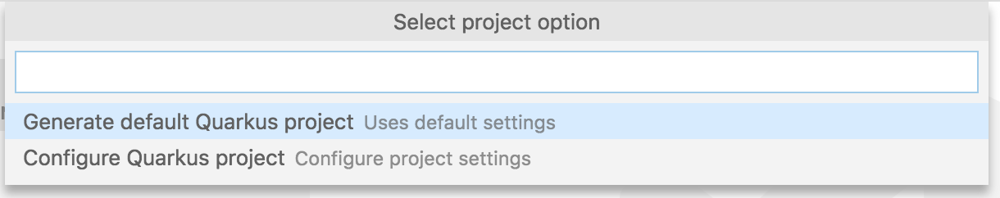
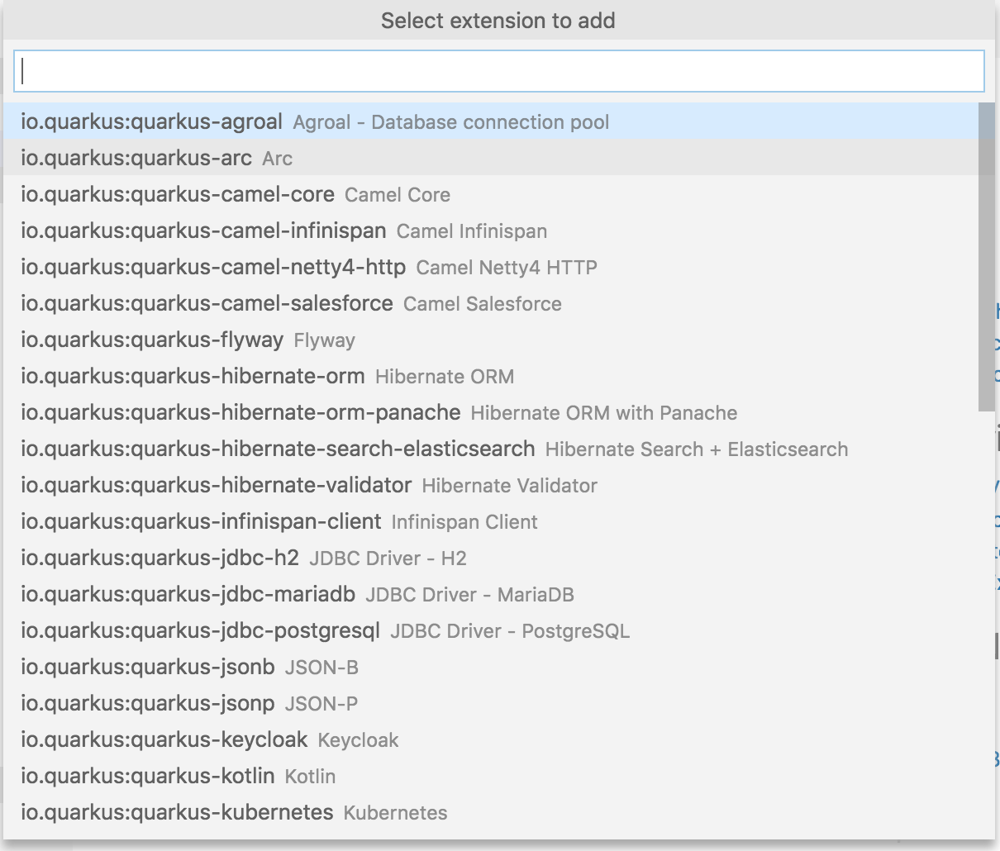

# QUARKUS VSC Extension

Quarkus (https://quarkus.io/) extension for VSC.

## Features

1. Allows to generate a new Quarkus Project. You can choose between generating a new project with default settings, or configure your projects settings before generating.



2. Allows you to add new Quarkus extensions to an already existing/generated Quarkus project.



3. Allows you start your Quarkus project in development mode.

4. Provides several Quarkus related code snippets

More features coming soon :)

## Commands

After installing this extension you will have two new commands available:

1. **Quarkus: Generate Quarkus project**
2. **Quarkus: Enable Quarkus extension**
3. **Quarkus: Run app in dev mode**

These commands can be accessed via the Command Panellete. To open the Command Pallette
use F5 for Windows or ⇧⌘P on OSX).

## Code Snippets

After installing this extension several Java code snippets will be added:

1. **qrc** - Crete new Quarkus resource class
2. **qrm** - Crete new Quarkus resource method
3. **qtrc** - Crete new Quarkus test resource class
4. **qntrc** - Crete new Quarkus native test resource class

## Requirements

Must maven Maven installed.

## Building from source

If you do not want to get this extension from the Marketplace or would like to build and test
the latest changes/updates locally follow these steps:

1. Clone the extension git repository

```
git clone https://github.com/tsurdilo/quarkus-vsc.git
cd quarkus-vsc
```

2. Build and package the extension with vsce:

```
vsce package
```

To install vsce run:

```
npm install -g vsce
```

3. vsce will create a quarkus-vsc-$VERSION$.vsix file which you have to install to your ide, for this run:

```
code --install-extension quarkus-vsc-$VERSION$.vsix
```

to uninstall the extension run:

```
code --uninstall-extension quarkus-vsc-$VERSION$.vsix
```

## Contributing

This extension is open-source and free to use to anyone.
All/any contributions are very welcome and much needed in order to make this extension much better.
Best way to contribute is to create Pull Request(s) on the github project.
